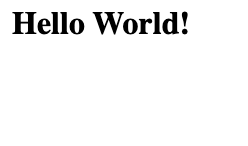
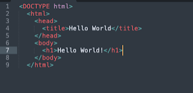

HTML

Hypertext Markup Language is a commonly used markup language for websites. It creates the structure. It is all the content you see on the website.

What HTML looks like on a webpage

What HTML looks like in a text editor

This website [https://motherfuckingwebsite.com/]([https://motherfuckingwebsite.com/](https://www.blogger.com/u/1/blog/post/edit/834585208066990729/8690226579302417373#)) shows how to create a webpage with just HTML.

HTML builds the structure of a webpage using text, images, and other forms that are rendered in the browser. Styling languages such as CSS and programming languages such as JavaScript are used alongside HTML to style and create dynamic websites

What's next: What are HTML elements?