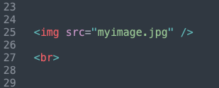

**HTML Elements(and Tags too)**

 An HTML element is one type of HTML component and is part of a webpage. HTML elements are not tags but are created using tags. Tags are used to mark the start and end of the element. Tags that create content elements utilize both opening and closing tags such as and

Commonly used tags to create content include html, head, link, header, nav, div body, footer, h1 - h6, and p among others. Each tag creates a different element. They can be used to display text, images, video, and other content in a webpage. Not all tags create content elements. Other tags create void elements.

Void elements are HTML elements that do not have content, they do have attributes. Void elements are created using tags that include br, meta, img, link, and input. Void tags are self-closing, since there is no content, the element's limits are defined just by the opening tag. Since a void element is created using a self closing tag cannot have children, text, or any content, such as

Unlike other elements, void elements cannot have children. A div may have multiple child elements such as 

An HTML element is an HTML component that is part of a webpage, it can display content or can be a void element that does not have content but has attributes. HTML elements are created using tags, content elements use opening and closing tags while void elements just need an opening tag. HTML elements are a vital component of a webpage and necessary when designing, they are what they user sees on their screen when they go to a website.

Next: Semantic HTML