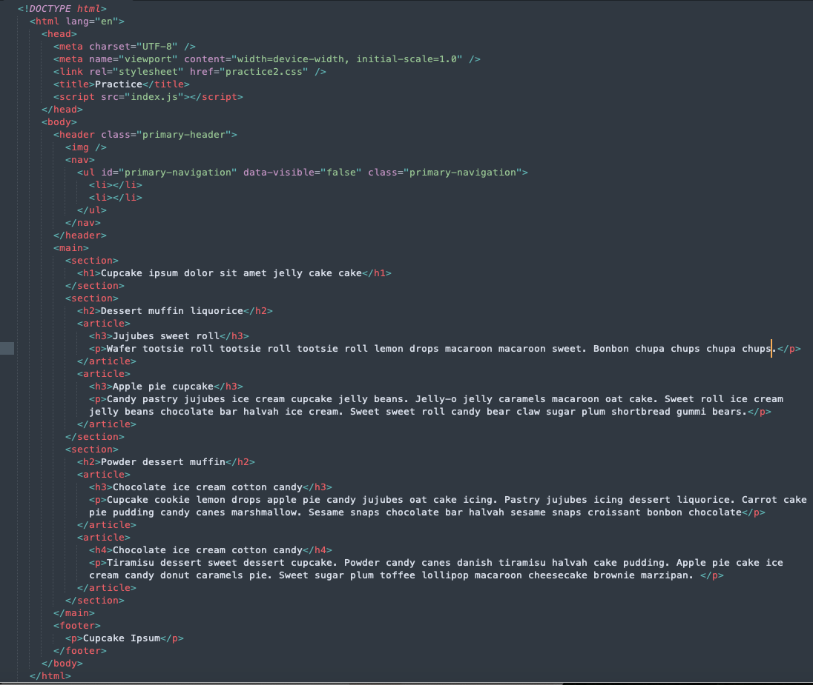

HTML semantic elements are HTML elements with meaning by defining what the content is, how the content is supposed to behave and have specific attributes for their content. It uses tags that convey meaning as well as define the presentation. A div tag defines a section in an HTML document and can be used as a container. However a div tag doesn’t define what the content of the container is. Semantic tags such as nav, section, and article create a section and container in an HTML but they also convey meaning, defining what the content is, such as navigation, and how the element is supposed to behave on the webpage. 

 

 

Semantic tags have default styles in most browser’s stylesheet, called user agent stylesheet. The h1 tag has the meaning or role of top level heading on this page. That heading is styled with the top level heading default styles of a browser user agent stylesheet which can include a larger font size and bolder font weight. 

 

Why use semantic elements? Especially when non-semantic elements can get the job done. Accessibility, making websites accessible for everyone, including people with disabilities. Semantic HTML creates landmarks by giving the content roles, the tag header has the role of banner built in. Screen readers use landmarks to help people with visual impairments navigate the page without wasting the user’s name by reading out repetitive or irrelevant information. SEO, search engines look at the content of the markup and use important keywords to influence a page’s ranking. 

 

Up Next: How to use semantic HTML.
