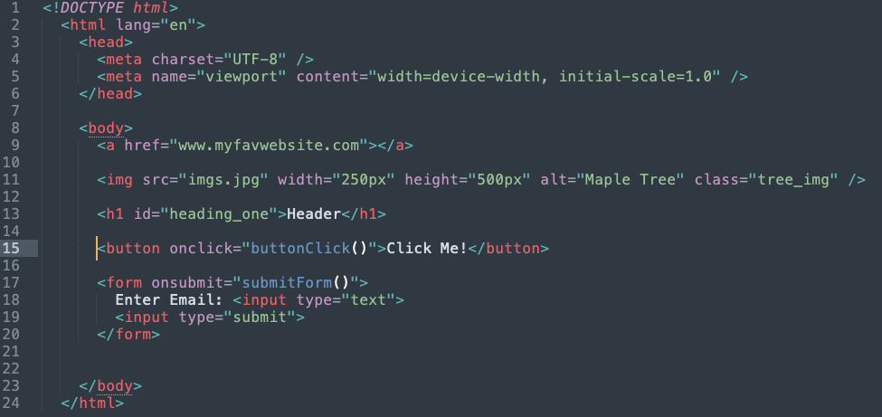
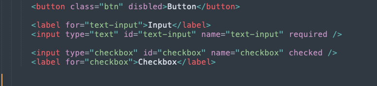

HTML attributes are pieces of additional information for an element. That additional information can define an element’s role, change an element's default behavior to configure, or adjust the element. Some elements have required attributes, other attributes are optional and only need to be used when desired to define the element or change its default behavior. Attributes are written in name-value pairs, name=”value”.

Attributes are specified in the opening tag. Attributes come in name-value pairs and in the markup look like name=“value” . Some common attributes are class, id, and style that can be used with almost any tag. Others such as href, src and used with specific tags such as an a or an image tag. 

The light violet text after the opening tag is the attribute name and the green text in quotes the attributes value.

Global attributes are attributes that can be used with any HTML element, some frequently used global attributes are class, id, and hidden. Other attributes are specific to get tags like an src for an image, input, script, or source tags, and href for script or link tags. 

<https://www.w3schools.com/tags/ref_standardattributes.asp>

Boolean attributes are attributes that just have to be present to be true. Attributes such as id are written id=”id-value,” boolean attributes such as hidden are written hidden instead of hidden=”true”. Just adding the name of a boolean attribute makes the value true. Other boolean attributes include required, disabled, and checked.

<https://developer.mozilla.org/en-US/docs/Web/HTML/Attributes#boolean_attributes>

\
Global event attributes trigger action in the browser such as running a function when the user engages with an element. They can be added to any element to define event actions. However the use of an event handler in HTML is discouraged since it can create unmanageable code and may be blocked by content security policies. Instead of using an event attribute in HTML, an event listener can be used inside a script tag or in an external JavaScript file.

<https://www.w3schools.com/tags/ref_eventattributes.asp>

<https://developer.mozilla.org/en-US/docs/Web/HTML/Attributes#event_handler_attributes>

The style attribute that can be used to style HTML using inline CSS. There are legacy attributes that have been used to create inline styles such as border, bgcolor, and color. Since they are legacy attributes the CSS property should be used instead of those attributes.This can be done with inline CSS with a style attribute, internal CSS, or external CSS a separate file from the HTML.

HTML attribute references

<https://www.w3schools.com/tags/ref_attributes.asp>

<https://developer.mozilla.org/en-US/docs/Web/HTML/Attributes> 

Up next: Heading