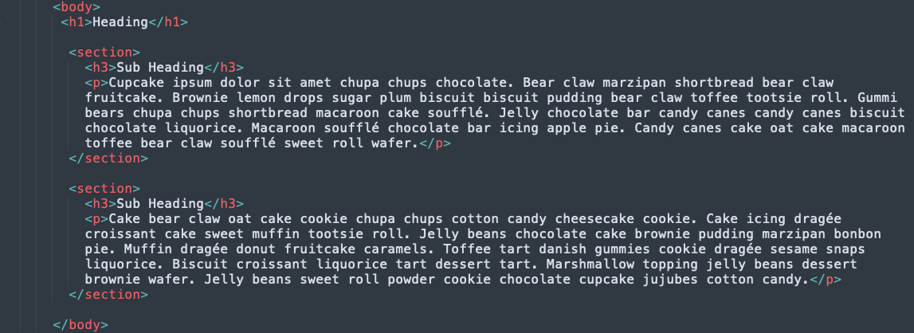
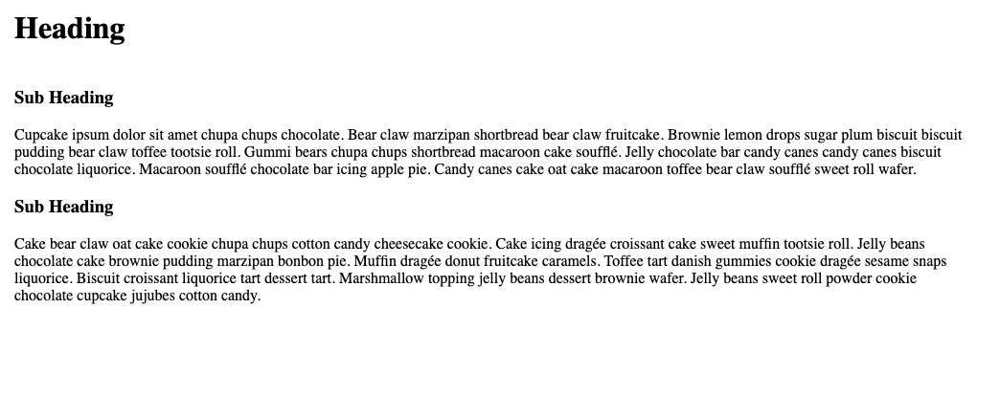
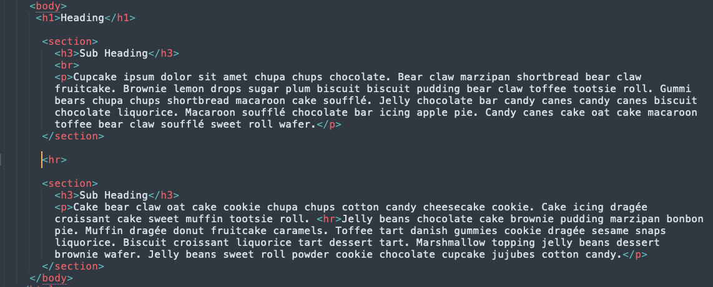
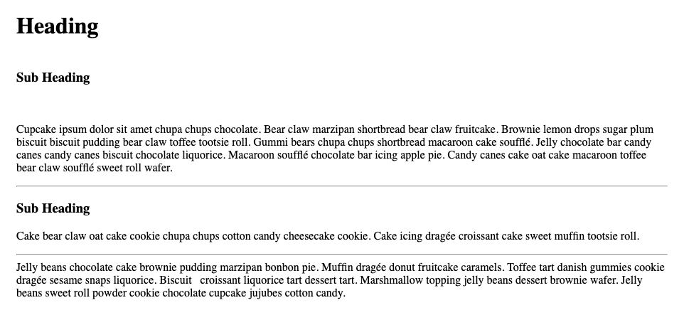

A paragraph is an HTML element that is created using a p tag, they also contain a group of related content. Paragraphs have both an opening tag and closing tag with content in between the tags. They are represented as blocks of content separate from other elements.

How paragraphs look in HTML and rendered on a webpage

Browsers have default styling for paragraphs such as starting a new line and white space above, below and to the sides of the element. When using p tags browsers remove any extra whitespace in the HTML between the tags when rendering the webpage, extra lines, spaces, or tabs will be removed by the browser. In HTML, br and hr tags can be used to create line breaks within a paragraph. A br element creates horizontal white space, while an hr element creates a horizontal line. They are used to style and/or denote a thematic change in the content. 

The default styles from the browser can be changed using CSS. Other styles such as first line indentation, adding white space above, below, or to the sides of the margin can be created using CSS properties to style a paragraph such as margin, padding, text-indent.

Next: Styles