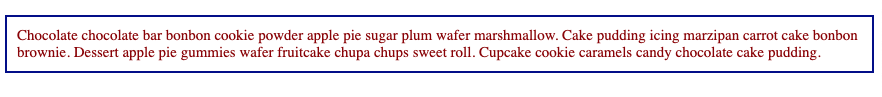

Styles is an HTML attribute used to add styles to an element. In HTML it is written as

```
<h1 style="color:darkgreen; font-family:sans-serif;">TITLE</h1>
```


The style attribute uses CSS property-value pairs to change the default appearance of an HTML. It can make the font larger, smaller, or the element a different color depending on the CSS property-value pair.

```
<p style="color:darkred; font-size:15px; width:100%, margin: 15px; padding:10px; border:2px solid darkblue;">Chocolate chocolate bar bonbon cookie powder apple pie sugar plum wafer marshmallow. Cake pudding icing marzipan carrot cake bonbon brownie. Dessert apple pie gummies wafer fruitcake chupa chups sweet roll. Cupcake cookie caramels candy chocolate cake pudding.</p>
```



The style attribute uses inline CSS to add styling to HTML. Any valid CSS property-value pair is valid inside the style attribute.


NEXT: What is CSS?